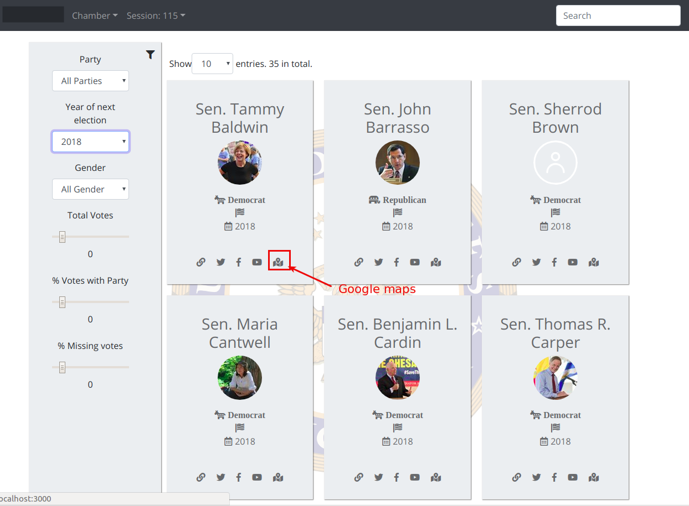

## ProPublica React App

[Go to Live Demo](http://com.luismejia.propublica.s3-website-us-east-1.amazonaws.com/)



This project was created with [create-react-app](https://github.com/facebook/create-react-app)

This app, use API call to [ProPublica Congress API](https://projects.propublica.org/api-docs/congress-api/members/#lists-of-members). You can review their documentation for more info on the structure of congressperson data.


## Set Api Keys

You can get a Pro publica API Key for free at their website.
You can get a Google Maps API from Google Console

The api keys can be set at src/settings/settings.js

```
  static API_KEY: string = 'PROPUBLICA API KEY';
  static MAPS_API_KEY: string = 'GOOGLE MAPS API KEY';
```

## Run the project

You can run the app by running `yarn start`. It supports most ES6 syntax, comes with [bootstrap](http://getbootstrap.com/docs/4.1/getting-started/introduction/), and will live-reload while developing.

```
npm install
yarn start
```

## What can you find in this app?
* **Propublica Api requests** to fetch data.

* **Congresspeople list view**: which contains for each congressperson:
    * A full name,
    * Social media links
    * party
    * their district/state,
    * the next year in which they are up for election.
* **Congressperson Detail view**: which calls the detailed API for that congressperson and shows additional information on their roles/committee membership when the user clicks on a specific list item.

* **Searching Bar** for Senators or Representatives by name.
* **UI for filtering**: to filter data of congresspeople by:
  * various characteristics (e.g. party, year of next election, gender, etc)
  * Filters components to change the parameters that are being passed to the API -- i.e. chamber (`house` or `senate`) and congressional session (the default is `115`), and reload the list with the new data.
* **Loading UI (Spinner)** while data is being fetched from the API.

* **A slider UI** that allows the user to drag along a scale to hide/show congresspeople who satisfy the criteria for data points that are ranges or percentages  like `total_votes` or `votes_with_party_percentage`.
*  **Cache on local device:** cache for the data on the device so that we don't need to make redundant calls to the API for data we have fetched previously.
* **Google Maps API** to show a map with a pin for the office location when the user clicks on a specific list item.

* **Routing mechanism** so that each search property is encoded in the URL, such that we can refresh the page and still see the same result.

* **Testing**

    * CRA comes packaged with the [`jest`](https://github.com/facebook/jest) testing library. It also sets up a sample test file in `App.test.js` and you can run the tests using `yarn test`. You can find additional info on testing in CRA [here](https://github.com/facebook/create-react-app/blob/master/packages/react-scripts/template/README.md#running-tests).


* **APP Settings**: I have included a Settings module to centralized all configurations for the app. For custom app settings, refer to settings/settings


# ONLINE RESOURCES

course:
https://www.udemy.com/react-the-complete-guide-incl-redux

spinner sytle
https://projects.lukehaas.me/css-loaders/

articles
https://scotch.io/tutorials/build-custom-pagination-with-react
https://jsramblings.com/2018/01/15/3-ways-to-test-mapStateToProps-and-mapDispatchToProps.html

https://bootsnipp.com/snippets/featured/contact-list

How to Make a Google Map with React.js? - A Step-by-Step Tutorial

https://www.youtube.com/watch?v=LRptz31H0vI

(Geocoder)
https://github.com/tomchentw/react-google-maps/issues/324

